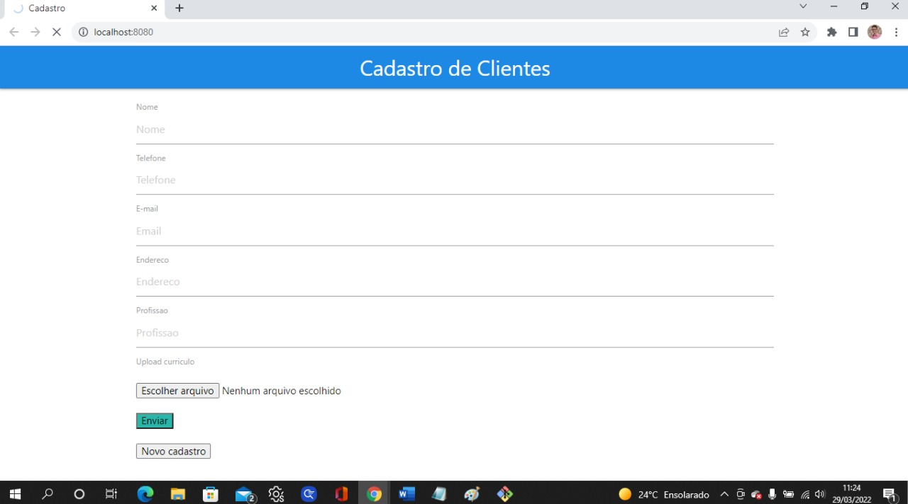
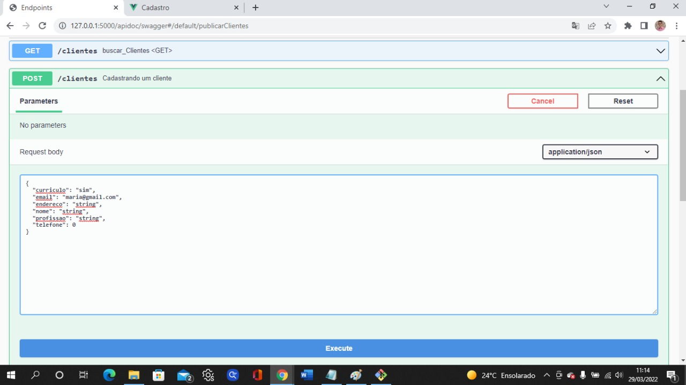

<h1> API Rest </h1>

[](https://www.npmjs.com/package/vue-gapi) [](https://v3.vuejs.org/)

## Sobre o Projeto
Consiste em uma API com interface frontend que permite realizar o cadastro de cliente com as seguintes características:

- Suporta GET, POST, DELETE, UPDATE
- Gera logs com nível 1, 2, 3, 4, 5
- Suporta banco de dados nosql
- Possui documentação declarada através de um endpoint

### Construído com:

- [Vue.js](https://vuejs.org/)
- [Flask](https://flask.palletsprojects.com/en/2.1.x/)
- [TinyDB](https://tinydb.readthedocs.io/en/latest/)

### Preview





## Instalação

### Local

#### Backend

- Criar um ambiente virtual com: 
```shell
python -m venv venv
```

- Instalar da biblioteca Flask: 

```shell
pip install flask
```

- Instalar a biblioteca de aplicações Werkzeug: 
```shell
pip install Werkzeug==0.16.0
```

Se requerido:
```shell
pip install Werkzeug==2.0.3
```

- Instalar Flask-Pydantic-Spec para validação dos dados: 
```shell
pip install flask-pydantic-spec
``` 

- Instalar o TinyDB:
```shell
pip install tinydb
``` 

- Instalar Flask-Cors para possíveis intercorrências ao rodar o frontend no navegador: 
```shell
pip install flask-cors
``` 

- Para rodar a API (backend): 
```shell
python main.py
``` 
 
#### Frontend:

- Após instalar o VUEjs, no terminal (podendo ser no terminal de seu editor) digite: 
```shell
vue create api_vue
```

- Acesse o diretório criado (na minha máquina foi acessado com:
```shell
cd .\api_vue\
```

- Instale a Axios para estabelecer a conexão com o backend com: 
```shell
npm install axios --save
```

- Compile com: 
```shell
npm run serve 
```

### Acessos:
- Backend: [127.0.0.1:5000/](127.0.0.1:5000/)
- Frontend: [127.0.0.1:8080/](127.0.0.1:8080/)

## Docker
Para configurar o projeto com Docker, siga os passos a seguir:

1. Instalar o Docker seguindo as instruções disponíveis no [site oficial](https://docs.docker.com/get-docker/).

2. Construir a imagem
```shell
docker-compose up -d --build
```

3. Iniciar o container
```shell
docker-compose up 
```
  

